# GRAD-FACE

## Machine Learning and Deep Learning AGH PhD Program Course
### Author: Wiktor Bornus

## 1. Introduction

Deep learning-based face recognition systems have become one of the most widely used biometric technologies, enabling 
applications such as identity verification, access control, surveillance, and authentication systems. Modern face 
recognition models achieve outstanding performance by learning complex representations of human faces from large-scale 
datasets. However, despite their high accuracy, these models often operate as black-box systems, where the internal 
decision-making process is difficult for humans to interpret.

This project focuses on investigating the interpretability of deep learning-based face recognition models using the 
Gradient-weighted Class Activation Mapping (**Grad-CAM**) algorithm. Grad-CAM is an explainability technique that produces 
visual heatmaps highlighting regions of an input image that have the strongest influence on a neural network's output. 
By analyzing these activation maps, it is possible to better understand what facial features are considered important 
by the model during the biometric verification process.

Two state-of-the-art face recognition architectures are investigated in this project: **FaceNet** and **InsightFace**.

The results of this analysis provide insights into the internal behavior of deep face recognition models and demonstrate 
how explainability methods can be used to improve understanding and evaluation of biometric systems.

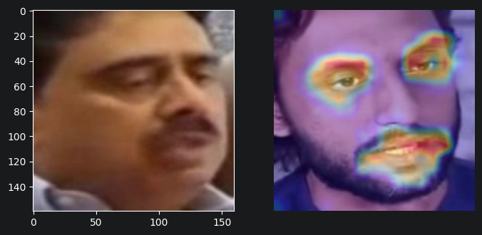

## 2. Project Goals
The main objective of this project is to evaluate and compare how different face recognition models focus on facial 
regions during biometric identification. Using Grad-CAM visualizations, the project aims to analyze whether the models 
rely on meaningful facial characteristics, such as eyes, nose, or mouth regions, and to investigate differences in 
interpretability between the selected architectures. Another crucial aspect of the research is using different levels
of latent space representation for Grad-CAM investigation. Each model was analyzed with respect to number of different
levels (depths) of neural network output.
## 3. Repository Structure
The repository is structured as follows:
```text
mlndl-gradface
│
├
└
─
│
├ README.md
├ facenet - experimental notebooks and mockups for facenet dnn
├ insightface - experimental notebooks and mockups for insightface dnn
├ facenet_repeat_1
├ facenet_repeat_2
│   └ notebooks with evaluation of Facenet - layers "repeat_1" and "repeat_2" 
├ insightface_layer_1-4
│   └ notebooks with evaluation of InsightFace - layers 1 - 4
├ heatmaps - png files with generated hearmaps presenting Grad-CAM heatmaps 
    for positive and negative trials with score range separation

```
## 4. Dataset
Dataset used for this task is a MAVCELEB https://mavceleb.github.io/dataset/ dataset of Multi-lingual Audio Visual 
dataset if Celebrities. For the purpose of experiments photos from **v1 English Face subset** was used. V1 dataset 
consists of 64 identities with photos and audio recordings in both English and Urdu languages.
## 5. Methodology
### Face detection and preprocessing
The preprocessing pipeline consists of:

1. Loading two face images from the dataset - positive and negative pairs are processed by separate scripts.
2. Detecting and extracting a frontal face region using MTCNN.
3. Aligning and resizing the face image to the input resolution required (160x160 for FaceNet and 112x112 for InsightFace).
4. Passing the normalized face tensors to the recognition model.

### Face embedding Generation

The dnn model does not directly classify identities. Instead, it maps each input face image into N-dimensional 
embedding vector.
For two input images:
- Image A: probe image
- Image B: reference image

the model produces:

e_A = dnn(A)

e_B = dnn(B)

where e_A and e_B represent high-dimensional feature vectors describing facial characteristics.

The similarity between the two faces is calculated using cosine similarity:

Higher similarity values indicate that the model considers the two faces more likely to belong to the same identity.

### Grad-CAM for face verification
Grad-CAM is originally designed for classification networks, where the target output corresponds to a class 
probability. However, face recognition models produce embeddings instead of class predictions.

To adapt Grad-CAM for biometric verification, a custom target function was created.

Instead of explaining a classification score, the algorithm explains the similarity between the probe image 
embedding and a reference embedding:

Target = cosine(e_A,e_B)

During the backward pass, Grad-CAM calculates gradients of this similarity score with respect to feature maps 
inside the network.

The final heatmap represents image regions that have the greatest contribution toward increasing the similarity 
between the two facial embeddings.

In this experiment, Grad-CAM is applied to a number of different layer outputs:
FaceNet:
- repeat_1
- repeat_2
- maxpool_3a

InsightFace:
- layer1
- layer2
- layer3
- layer4

### Score-Based Heatmap Analysis
After collecting Grad-CAM maps, samples are grouped according to their cosine similarity score. The similarity ranges
are provided on plots in section "Results".

For each interval, Grad-CAM maps are averaged to obtain a representative visualization of the facial regions used by the 
model at different confidence levels. This allows analysis of whether the model relies on different characteristics 
depending on the strength of the biometric match. It also helps to model the characteristics of decision-making for
positive and negative trials.
## 6. Results
Below are presented heatmaps with Grad-CAM results for positive and negative trials computed for two DNN models and 
their selected latent space layers. Rows in tables below present heatmaps from the shallowest to the deepest latent 
space layers.

## FaceNET

|              |                          Positive trials                           |                          Negative trials                          |
|:------------:|:------------------------------------------------------------------:|:-----------------------------------------------------------------:|
| *maxpool_3a* | 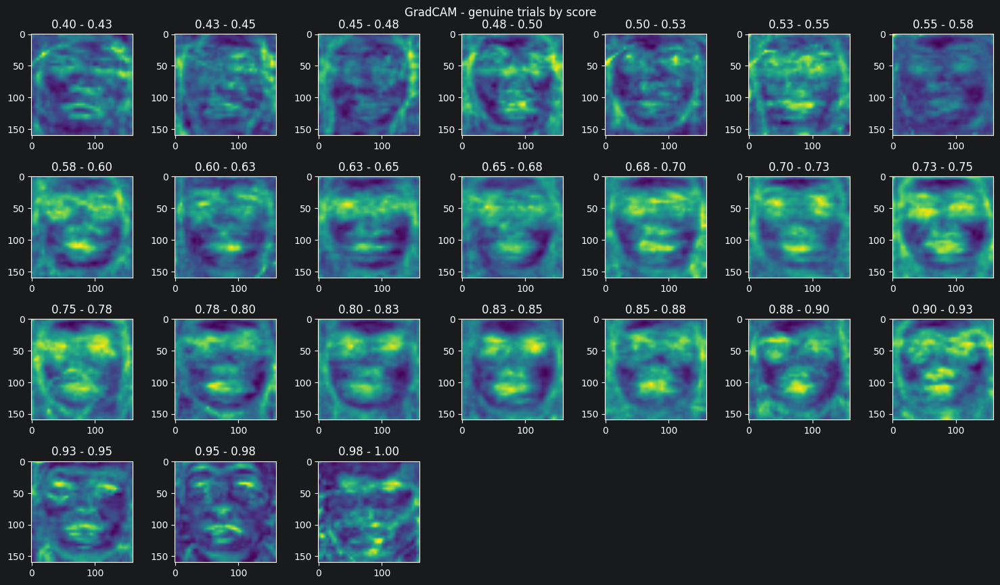 | 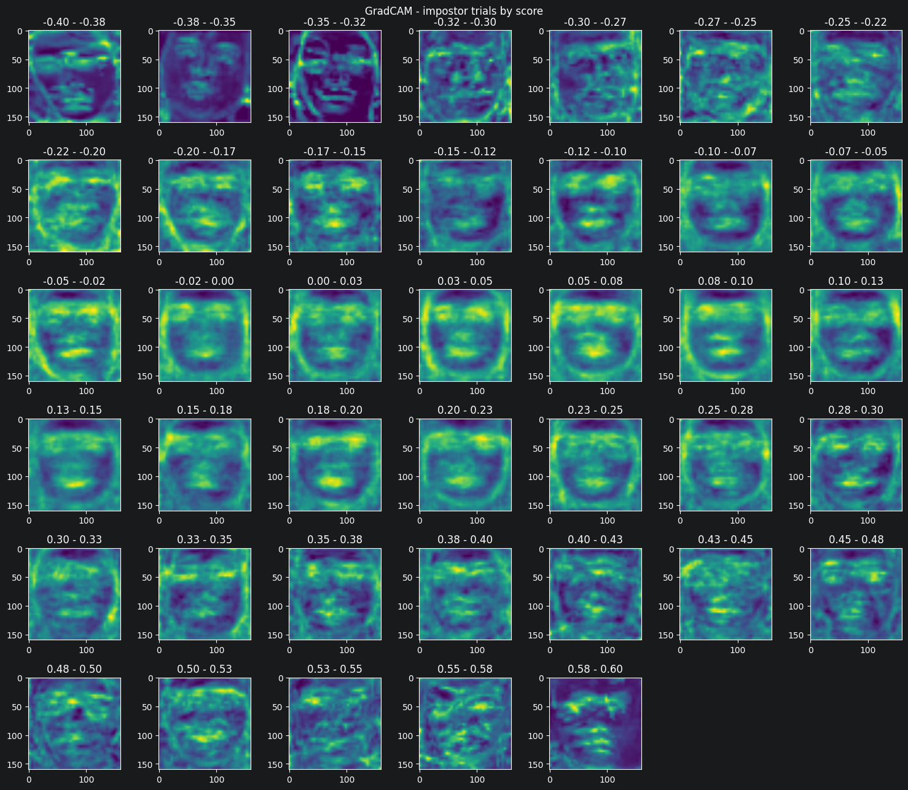 |
|  *repeat 1*  |  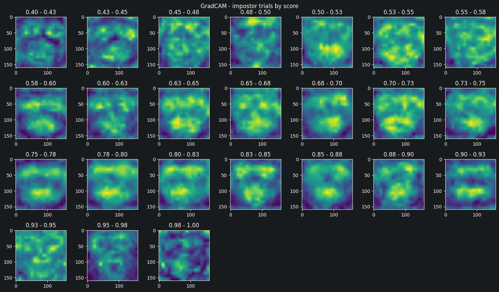  | 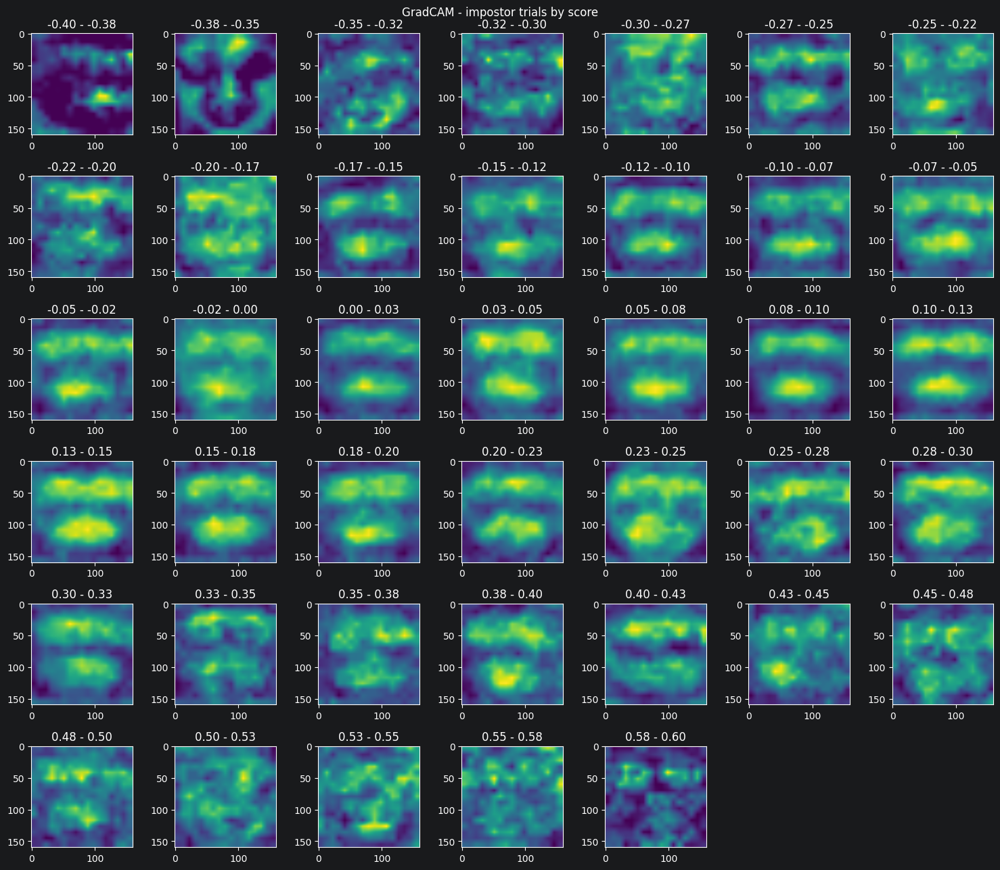  |
|  *repeat 2*  |  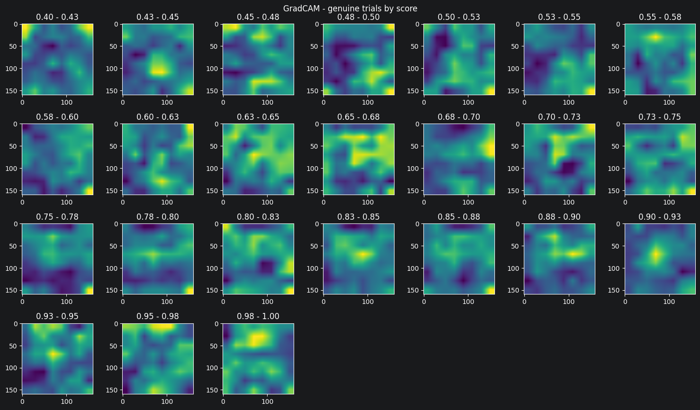  | 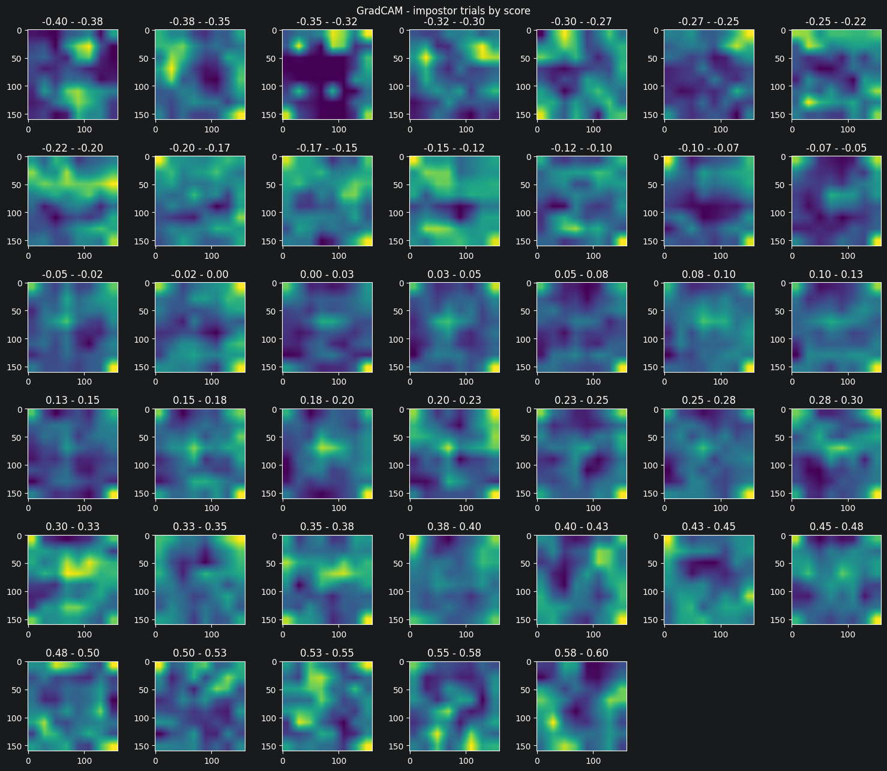  |

## InsightFace
|           |                          Positive trials                          |                          Negative trials                          |
|:---------:|:-----------------------------------------------------------------:|:-----------------------------------------------------------------:|
| *layer_1* | 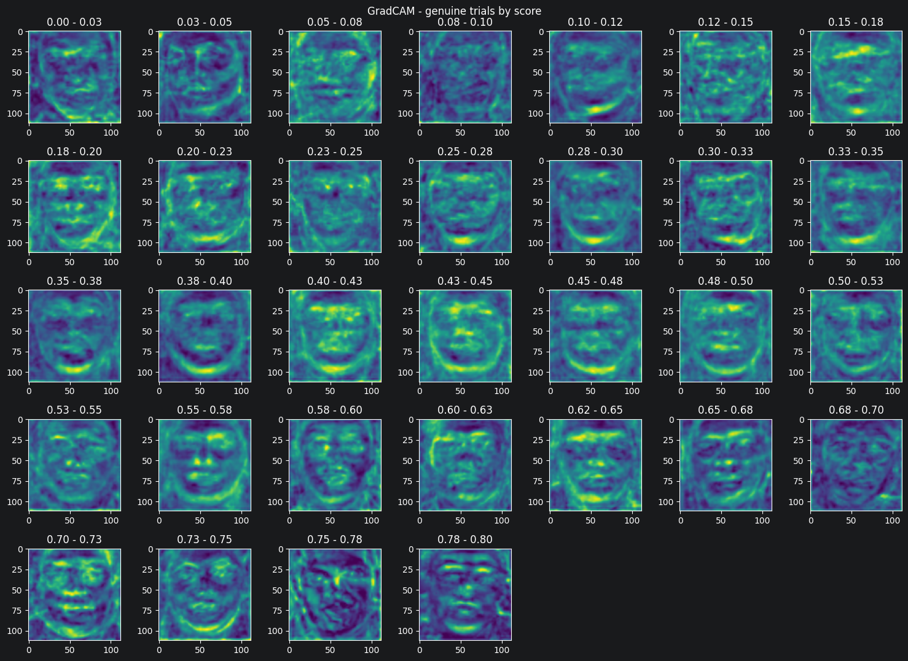 | 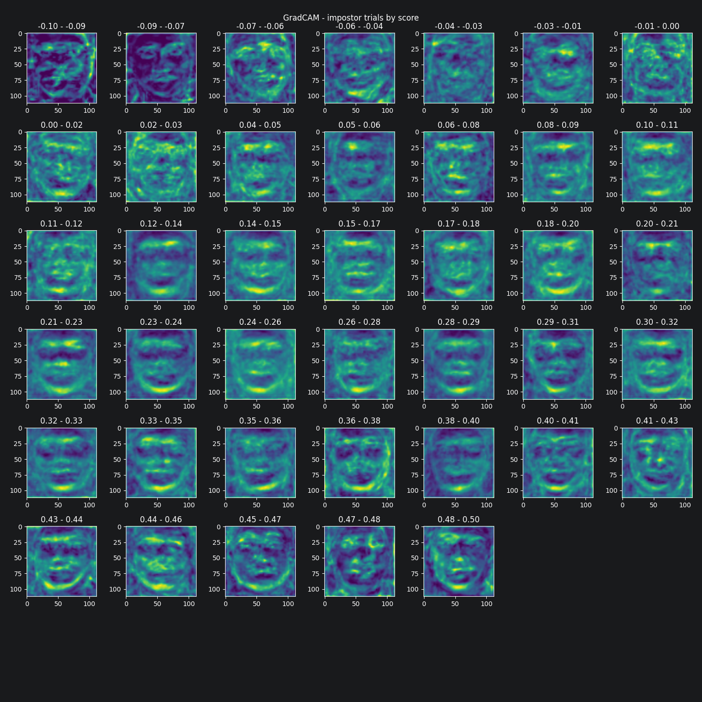 |
| *layer_2* | 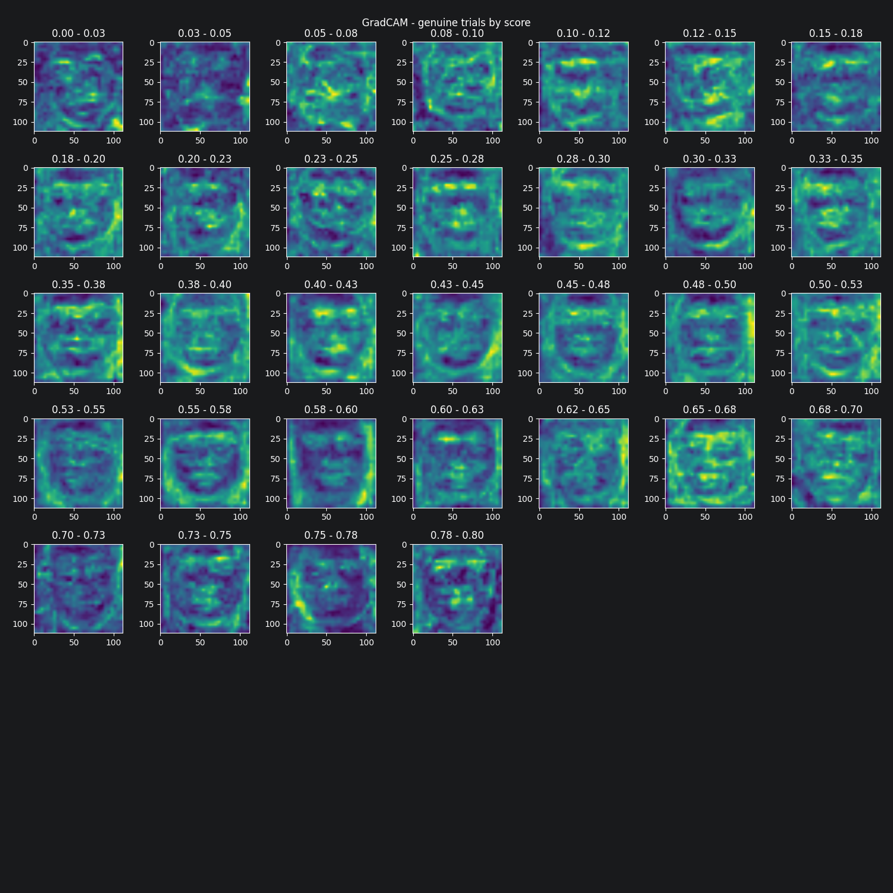 | 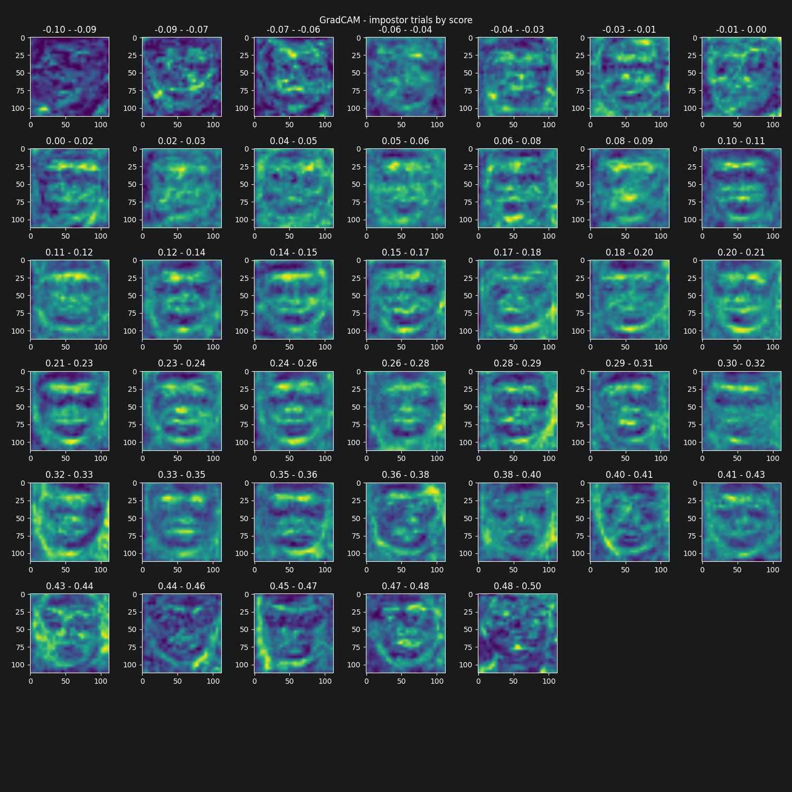 |
| *layer_3* | 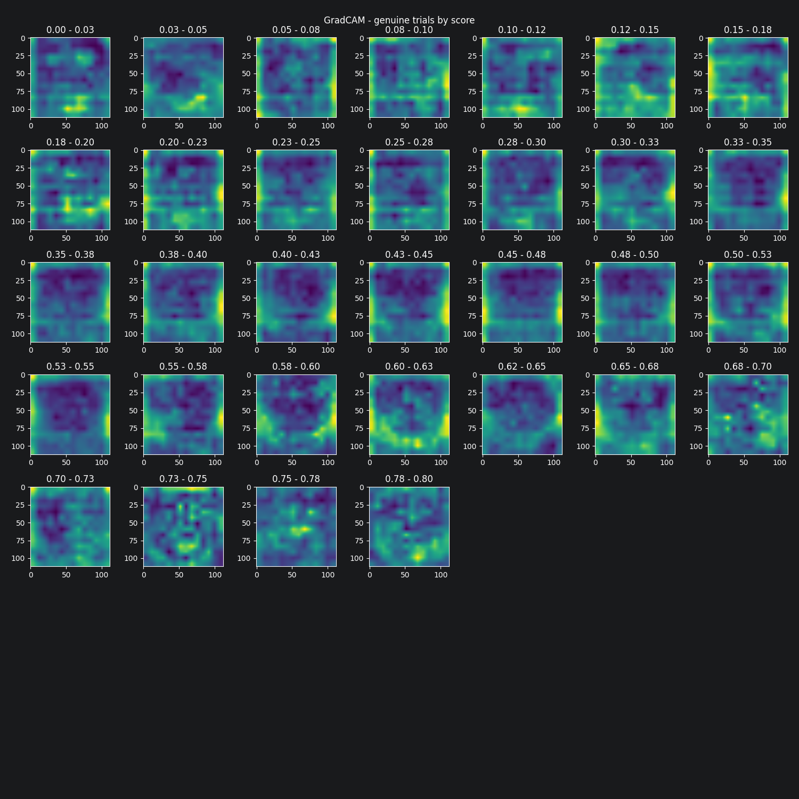 |  |
| *layer_4* | 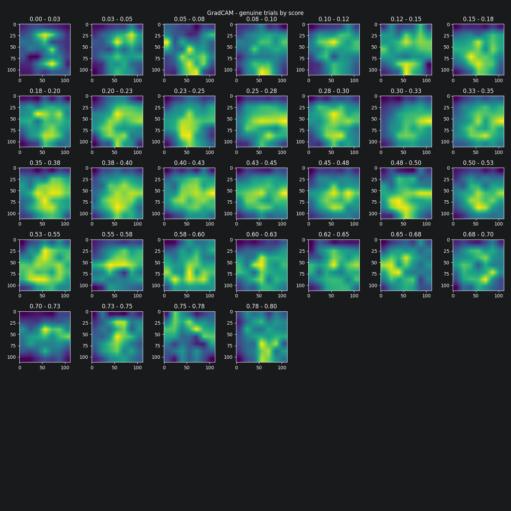 |  |


## 7. Conclusion and Future Work

## Conclusion

The presented results demonstrate that face biometric verification is inherently susceptible to recognition errors and 
that the verification score alone does not fully explain the model's decision-making process. By applying the Grad-CAM 
algorithm to different deep neural network architectures and selected layers within those architectures, it is possible
to visualize the facial regions that contribute most to the generation of facial embeddings.

The averaged Grad-CAM heatmaps indicate that the models focus on different facial regions depending on the similarity 
score between the compared face embeddings. This observation suggests that the visual evidence supporting a verification
decision changes with the confidence of the match. Consequently, the similarity score should not be considered the sole
source of information when analyzing biometric verification results. Instead, interpretability methods such as Grad-CAM 
can provide complementary insights into the reasoning behind the model's predictions.

Future work will focus on evaluating additional explainability techniques and comparing their effectiveness in the 
context of face recognition. Furthermore, this research will be extended toward automatic classification of 
verification trials as true positives, true negatives, false positives, or false negatives based on the correlation 
between Grad-CAM heatmaps generated for test images and representative heatmap patterns characteristic of each 
verification outcome. Such an approach may contribute to a better understanding of recognition errors and improve 
the interpretability of deep learning-based biometric systems.
